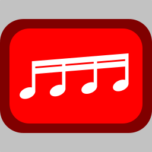

# Youtube Tab Playlist

When a youtube tab finishes playing its video, look for other youtube video tabs. If any are found, close the current youtube tab, select the next youtube tab and make it play its video.

Once the last youtube video tab is reached or if there is a single youtube tab, do nothing.

